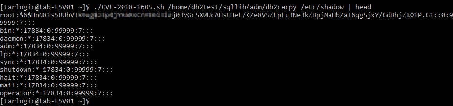

# CVE-2018-1685: Privilege escalation in IBM® Db2® tool db2cacpy

Arbitrary file read via path traversal in a root-owned SUID executable (db2cacpy):

The exploitation of this vulnerability involves overwriting `/etc/services`, but [our exploit](CVE-2018-1685.sh) handles this by backing up and restoring the original file at the end of the process.

#

__Security Bulletin:__ https://www.ibm.com/support/pages/security-bulletin-privilege-escalation-ibm%C2%AE-db2%C2%AE-tool-db2cacpy-cve-2018-1685 
#

  
