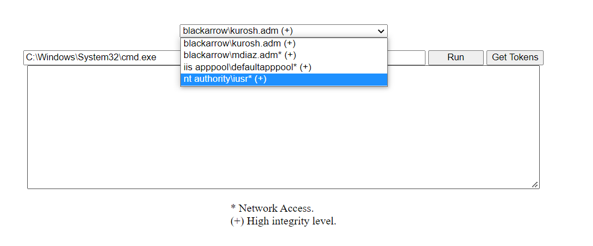

# Hanshell

## Summary

ASP.NET web shell to abuse leaked token handles. 

This shell is meant to be used to escape from the Application Pool Identity security context and perform privilege escalation after compromising a web app.

__Post URL:__ https://www.tarlogic.com/blog/token-handles-abuse-one-shell-to-handle-them-all/  

#

  