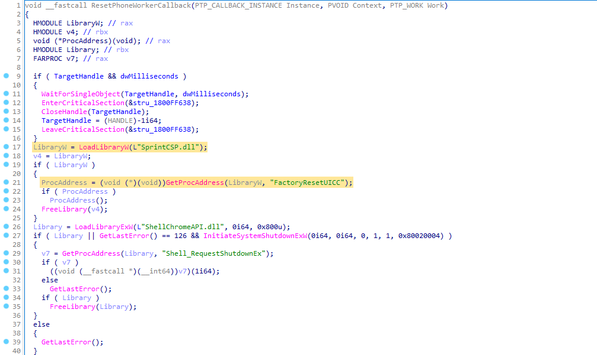
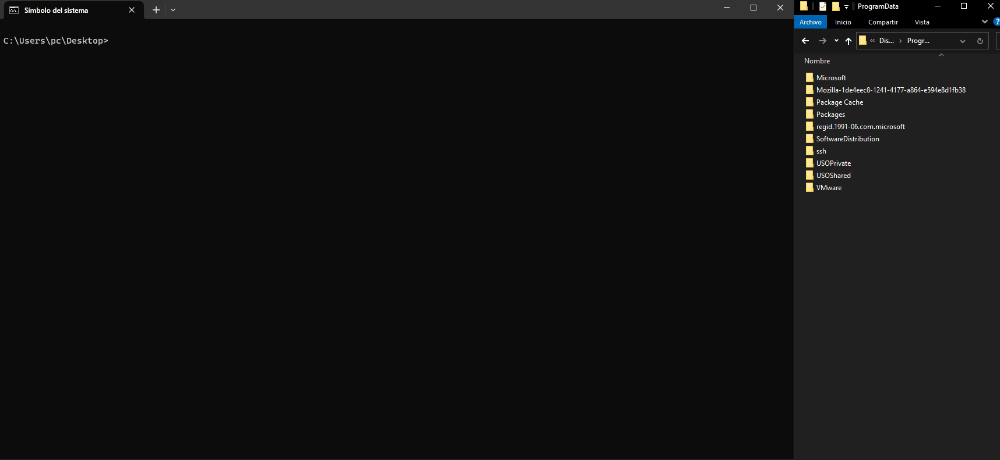

# LPE via StorSvc

Windows Local Privilege Escalation via StorSvc service (writable SYSTEM path DLL Hijacking)

## Summary

StorSvc is a service which runs as `NT AUTHORITY\SYSTEM` and tries to load the missing **SprintCSP.dll** DLL when triggering the `SvcRebootToFlashingMode` RPC method locally. 

## Description

The `StorSvc.dll!SvcRebootToFlashingMode` RPC method, calls `StorSvc.dll!InitResetPhone` which also calls `StorSvc.dll!ResetPhoneWorkerCallback`, that tries to load **SprintCSP.dll** as shown in the image below:



As this DLL is missing, it is loaded following the **DLL Search Order** flow and we can take advantage of this behaviour by placing a malicious DLL in a writable folder contained in the SYSTEM `%PATH%`. Then, the malicious DLL should be executed with **SYSTEM privileges**.

It is worth noting that the service is launched as `NT AUTHORITY\SYSTEM` in the service group `LocalSystemNetworkRestricted` which has the following privileges:

```
Privilege Name               Description                                         State       
============================ =================================================== =============
SeTcbPrivilege               Act as part of the operating system                 Enabled   
SeLoadDriverPrivilege        Load and unload device drivers                      Disabled
SeBackupPrivilege            Back up files and directories                       Disabled
SeRestorePrivilege           Restore files and directories                       Disabled
SeSystemEnvironmentPrivilege Modify firmware environment values                  Disabled
SeChangeNotifyPrivilege      Bypass traverse checking                            Enabled   
SeManageVolumePrivilege      Perform volume maintenance tasks                    Enabled   
```
The command line that corresponds to this service is `C:\Windows\System32\svchost.exe -k LocalSystemNetworkRestricted -p -s StorSvc`.

## Proof of Concept

In this repo we provide 2 different source codes:
- [**RpcClient.exe**](./RpcClient): that triggers the RPC call.
- [**SprintCSP.dll**](./SprintCSP/): which can be placed to exploit the DLL Hijacking. This PoC runs a `whoami` command and writes the output to `C:\ProgramData\whoamiall.txt`. If you want to expand the functionality of this PoC you can edit the `DoStuff()` function at [main.c](./SprintCSP/SprintCSP/main.c#L7).

The provided exploit should work by default and has been tested on **Windows 10**, **Windows 11**, **Windows Server 2019** and **Windows Server 2022**. **In order to make it work, the `#define` macro at [storsvc_c.c](./RpcClient/RpcClient/storsvc_c.c#L3) must be changed so the exploit is adapted to the target machine's operative system.**

After triggering the exploit it is necessary to **stop** or **reboot** the service, which [SprintCSP.dll](./SprintCSP/) already does.

### Steps

1. Find writable SYSTEM path with `reg query "HKLM\SYSTEM\CurrentControlSet\Control\Session Manager\Environment" -v Path`
2. Copy [SprintCSP.dll](./SprintCSP/) to the writable path
3. Execute [RpcClient.exe](./RpcClient)
4. Check `C:\ProgramData\whoamiall.txt`



## References

- [Fuzzing Windows RPC with RpcView](https://itm4n.github.io/fuzzing-windows-rpc-rpcview/)
- [CdpSvcLPE](https://github.com/sailay1996/CdpSvcLPE/blob/main/README.md)
- [CDPSvc DLL Hijacking - From LOCAL SERVICE to SYSTEM](https://itm4n.github.io/cdpsvc-dll-hijacking/)

#

[](https://www.blackarrow.net) [](https://twitter.com/BlackArrowSec) [](https://www.linkedin.com/company/blackarrowsec/)
